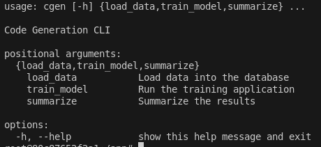

# CGen

[](LICENSE) [](https://codecov.io/gh/valentim/cgen)

## Overview

The primary goal of this project is to develop a code generation system that evaluates and improves its accuracy using a combination of techniques such as Tree of Thoughts (ToT), Generative AI, code interpretation, and code evaluation. This system aims to solve various coding problems efficiently and reliably by iteratively refining generated code based on identified errors.

### Note
> **Although the framework is designed to generate and validate code, its processes and components are sufficiently generic to be easily applicable to other purposes that require generating solutions and seeking continuous improvement.**

## Table of Contents
- [Pipeline](#pipeline)
    - [Key Components and Process](#key-components-and-process)
- [Installation](#installation)
    - [Requirements](#requirements)
- [Usage](#usage)
- [Development](#development)
- [CI/CD](#continuous-integration-ci)
- [Contributing](#contributing)
- [License](#license)


## Pipeline View
<p align="center">
  
</p>

### Key Components and Process
1. **Planning Agent (Initial Setup)**
    - Initial Prompt Acquisition
        - **Input**: The project starts with an MBPP (Many Big Public Problems) document containing coding problems and their respective test cases.
        - **Output**: An initial prompt derived from the MBPP document to initiate the code generation process.
    - Tree of Thoughts Creation
        - Nodes representing different prompt variations are created using Generative AI.
        - These variations form a "Tree of Thoughts" where each node represents a different approach or modification to the initial prompt.
2. **Coding Agent (Exploration and Generation)**
    - Three Navigation
        - Utilizes algorithms such as BFS (Breadth-First Search) or DFS (Depth-First Search) to traverse the tree of thoughts.
        - During traversal, each node’s prompt variation is used to generate code snippets.
    - Code Generation
        - **Input**: The prompt variations from the traversal process.
        - **Output**: Generated code snippets created by the Generative AI model based on the provided prompts.

3. **Debugging Agent (Testing and Validation)**
    - Code Testing and Validation
        - The generated code snippets are tested internally using predefined test cases from the MBPP document.
        - Evaluates the correctness of the code against these test cases to identify successful and failing snippets.
    - Iterative Improvement
        - Analyzes errors in the failing code snippets.
        - Adjusts the prompts based on error analysis and re-navigates through the tree of thoughts to generate improved code snippets.
4. **Finalization**
    - Result Summarization
    Compiles a summary report detailing the results of the code generation and testing process.
    - Provides insights into the successful solutions, the stability of the results on reruns, and the factors contributing to the success of the system.

## Installation

To install the necessary dependencies, you'll need [Poetry](https://python-poetry.org/docs/#installation).

1. Clone the repository:

   ```sh
   git clone https://github.com/valentim/cgen
   cd cgen
   ```
2. Install dependencies
    ```sh
    poetry install
    ```
## Requirements
- Python >= 3.10.12,<4.0
- Poetry >= 1.1.12
- Docker
- Docker Compose

## Usage
1. To run the project, use the following command:
    ```sh
    docker-compose up -d
    ```
2. Enter in the container:
    ```sh
    docker-compose exec cgen bash
    ```
3. Execute the CLI commands:

    ```sh
    poetry run cgen load_data --path datasets/mbpp.jsonl
    ```
    ```sh
    poetry run cgen train_model --lines 10
    ```
    ```sh
    poetry run cgen summarize
    ```
    

4. To view details about the commands:
    ```sh
    poetry run cgen --help
    ```
    
## Development
### Code Style
This project uses PEP 8 for code style guidelines. We use flake8 and black for linting and formatting.
#### To check the code style, run:
```sh
poetry run flake8
```
#### To format the code, run:
```sh
poetry run black .
```
### Testing
This project uses pytest for testing. To run the tests, use:

```sh
poetry run pytest
```
#### To run tests with coverage, use:
```sh
poetry run pytest --cov
```
### Environment Variables
This project uses environment variables for configuration. Copy the .env.example and create a .env file in the root directory of the project. For example:
## Environment Variables Explained
| Variable                                                                                                  | Description                                                                                                           | Example |
| ---------------------------------- | --------------------------------------------------------------------------------------------------------- | --------------------------------------------------------------------------------------------------------------------- |
| OPENAI_API_KEY                                                       | Your OpenAI API key. This is required to authenticate API requests to OpenAI services.                                                                                                                             | sk-{hash}                                                                                                                                                                                                                                  |
| ASSISTANT_NAME                                                       | The name of the assistant. This can be used to personalize responses or log messages.                                                                                                                              | Python Developer Tutor                                                                                                                                                                                                                     |
| ASSISTANT_INSTRUCTIONS                                               | Instructions for the assistant on how to behave or respond. This helps in configuring behavior.                                                                                                                    | You are a personal Python developer tutor. Write code to answer questions.                                                                                                                                                                 |
| ASSISTANT_INSTRUCTIONS_FOR_DETAILS                                   | Specific instructions for the assistant to create slight variations for the details provided.                                                                                                                      | You are an assistant and your task is to create slight variations for the details provided and only give json answers                                                                                                                      |
| ASSISTANT_TOOLS                                                      | Tools that the assistant is allowed to use. This can be configured as needed.                                                                                                                                      | [{"type": "code_interpreter"}]                                                                                                                                                                                                             |
| ASSISTANT_MODEL                                                      | The model to be used by the assistant. This defines which OpenAI model to use.                                                                                                                                     | gpt-4o                                                                                                                                                                                                                                     |
| ASSISTANT_MAX_TOKENS                                                 | The maximum number of tokens for the assistant's responses.                                                                                                                                                        | 2048                                                                                                                                                                                                                                       |
| ASSISTANT_TEMPERATURE                                                | Controls the randomness of the assistant's responses. Lower values make the responses more deterministic.                                                                                                          | 1                                                                                                                                                                                                                                          |
| ASSISTANT_TOP_P                                                      | Controls the diversity of the responses by limiting the results to a certain probability mass.                                                                                                                     | 1                                                                                                                                                                                                                                          |
| ASSISTANT_FREQUENCY_PENALTY                                          | Penalty for repeating tokens.                                                                                                                                                                                      | 0                                                                                                                                                                                                                                          |
| ASSISTANT_PRESENCE_PENALTY                                           | Penalty for introducing new tokens.                                                                                                                                                                                | 0                                                                                                                                                                                                                                          |
| BASE_VARIATIONS                                                      | A list of base variations for generating different prompts.                                                                                                                                                        | ["Use advanced programming techniques.", "Optimize for efficiency.", "Simplify the implementation."]                                                                                                                                       |
| PROMPT_TEMPLATE_PATH                                                 | Path to the prompt template file.                                                                                                                                                                                  |                                                                                                                                                                                                                                            |
| LOGGING_LEVEL                                                        | The logging level for the application.                                                                                                                                                                             | INFO                                                                                                                                                                                                                                       |
| THREE_MAX_DEPTHS                                                     | Max depth of the three of thoughts.                                                                                                                                                                              | 2                                                                                                                                                                                                                                          |


## Continuous Integration (CI)

This project uses GitHub Actions for Continuous Integration. The CI configuration is defined in the `.github/workflows/ci.yml` file.

Right now we do not have Continuous Deployment yet.

### Triggers

The CI workflow is triggered in the following situations:

- Push to any branch.
- Pull request to any branch.
- Manually, through the GitHub Actions interface.

### Environment Variables

The following environment variables are used in the CI workflow:

- `CODECOV_TOKEN`: Token required to upload code coverage to Codecov.

## Contributing
Contributions are welcome! Please follow these steps:

1. Fork the repository.
2. Create a new branch (git checkout -b feature-branch).
3. Make your changes.
4. Commit your changes (git commit -am 'Add new feature').
5. Push to the branch (git push origin feature-branch).
6. Create a new Pull Request.

Please make sure to update tests as appropriate.

## License
This project is licensed under the MIT License - see the LICENSE file for details.